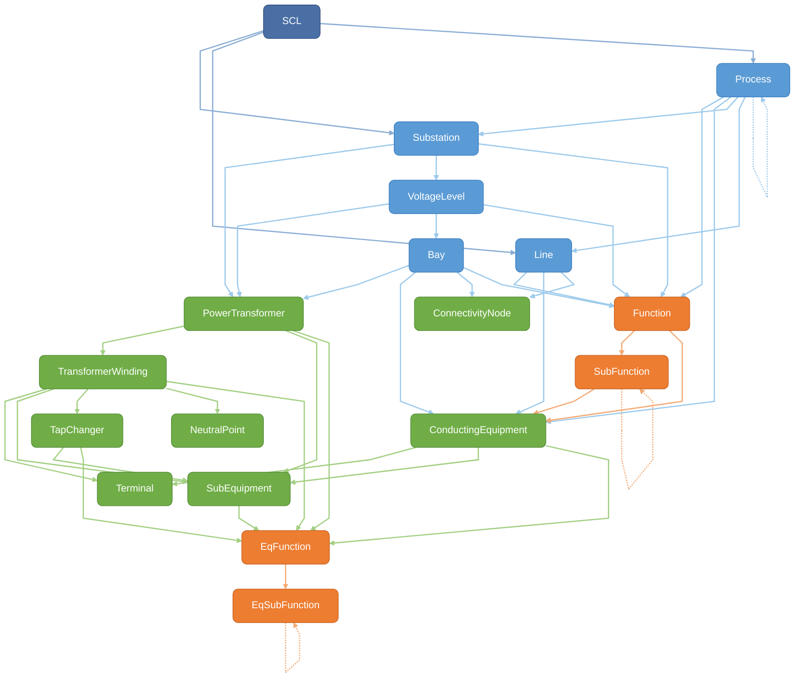
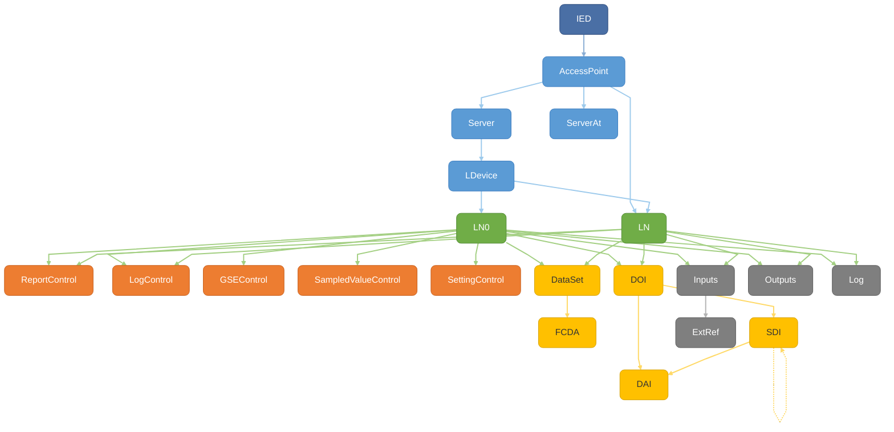
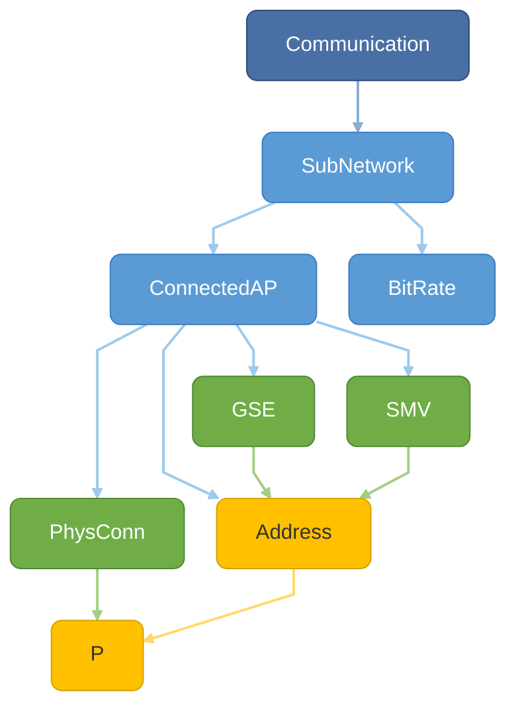
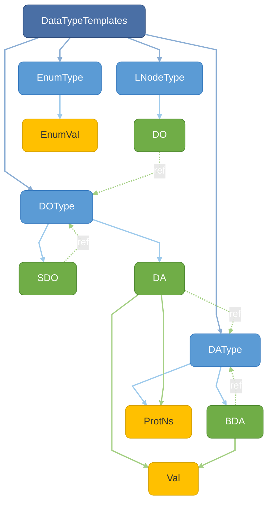

# Element Catalog

<!-- Auto-generated by scripts/generate-element-catalog.ts - do not edit -->

This page lists every SCL element recognized by `@dialecte/scl/v2019C1` (**210 elements**).

Source of truth: [`definition.generated.ts`](https://github.com/dialecte/scl/blob/main/src/v2019C1/definition/definition.generated.ts) | [`constants.generated.ts`](https://github.com/dialecte/scl/blob/main/src/v2019C1/definition/constants.generated.ts) | [`types.generated.ts`](https://github.com/dialecte/scl/blob/main/src/v2019C1/definition/types.generated.ts)

Regenerate: `npx tsx scripts/generate-element-catalog.ts`

## Schema overview

### Substation hierarchy

> **root** - **topology containers** - **primary equipment** - **functional model** - dashed = recursive/reference - edge color matches parent category
>
> **Shared children not shown:** `LNode` and `GeneralEquipment` can appear under almost every topology container and equipment element. See the element table below for full parent lists.

### IED / Server stack

> **IED root** - **server path** - **logical nodes** - **control blocks** - **data model** - **inputs/outputs** - dashed = recursive/reference - edge color matches parent category

### Communication network

> **root** - **network** - **protocol** - **addressing** - dashed = recursive/reference - edge color matches parent category

### Data type templates

> **root** - **type definitions** - **type members** - **leaf values** - dashed = recursive/reference - edge color matches parent category
>
> dashed = type reference (DO.type attribute points to a DOType.id)

<ElementCatalog />
